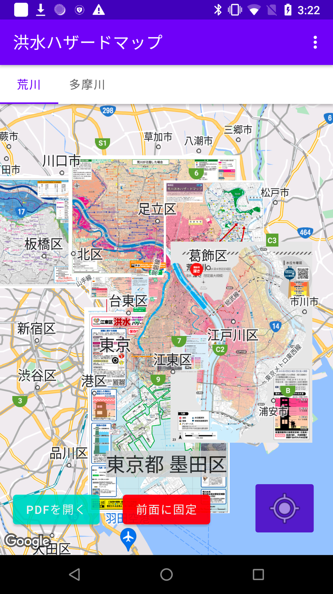
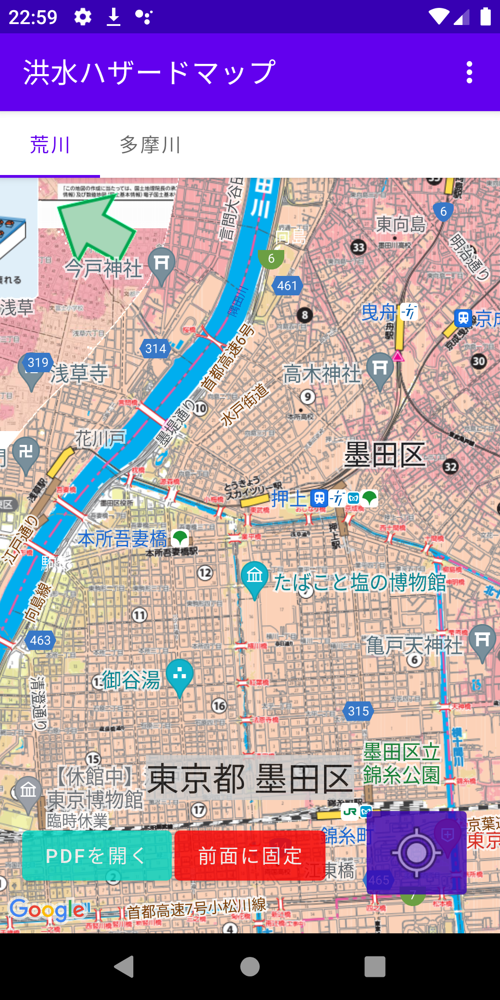
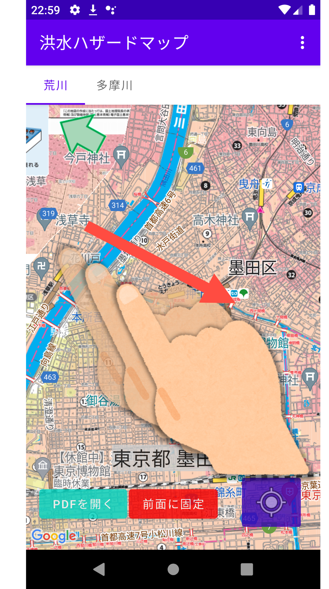
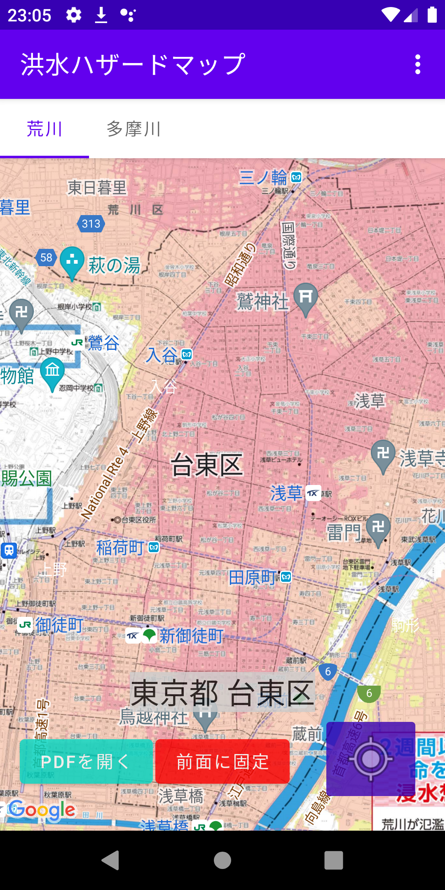
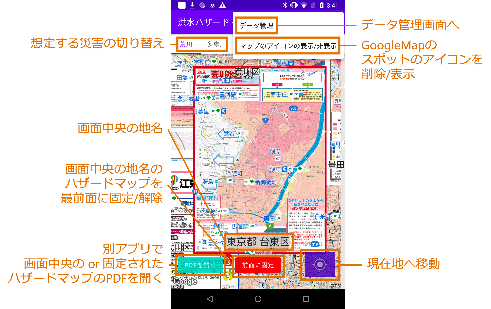

# ConnectedHazardMap
Androidアプリ開発の勉強で作ったアプリです

ダウンロードしたハザードマップがつながって見えるようにGoogleMap上に重ねて表示します

## 普通のハザードマップとの違い
- 自分の場所のハザードマップだと、地区の外への避難が推奨されていて結局どこまで避難すればいいかわからない
- 外出時に現在地の住所がわからないとハザードマップを調べられない

このような市区町村ごとのハザードマップを使用するときの不満の解消を目指しました

- 自治体が作成した詳細なハザードマップを**連結**することで、**スムーズに複数のハザードマップを閲覧可能**
- 位置情報を取得して**簡単に現在地のハザードマップにアクセス**

## 使用例
スカイツリー周辺から避難先を考える場合

1. アプリを開くと自動的に現在地の墨田区のハザードマップが表示されます 

2. ハザードマップ左上の緑の矢印に従って画面をスワイプすると…… 

3. お隣の台東区のハザードマップが表示され、上野付近まで避難すれば良いことがわかります 

## 主な機能

- 「表示地点を優先」モード と 「前面に固定」モード
  - 「表示地点を優先」モード: マップを動かすと、画面中央の地点が含まれている市区町村のハザードマップが前面に表示されます
  - 「前面に固定」モード: マップを動かしても、前面に表示していたハザードマップを前面に表示し続けます
    - ハザードマップの隅の凡例を見たいときの使用を想定
  - 画面下の中央のボタンで切り替えられます
- 「現在地へ移動」ボタン
  - 取得した位置情報をもとに現在地へマップを動かします

## 制約
- 荒川・多摩川洪水時のみ対応
- 東京都23区内の一部のみ対応

## ビルド
0. Google Maps API keyを用意（https://developers.google.com/maps/documentation/android-sdk/get-api-key）
1. Android Studioでプロジェクトとして開く
2. 用意したkeyをlocal.propertiesファイルに`MAPS_API_KEY=Aiza...`として設定
3. Run 'app' を押してビルド・実行
